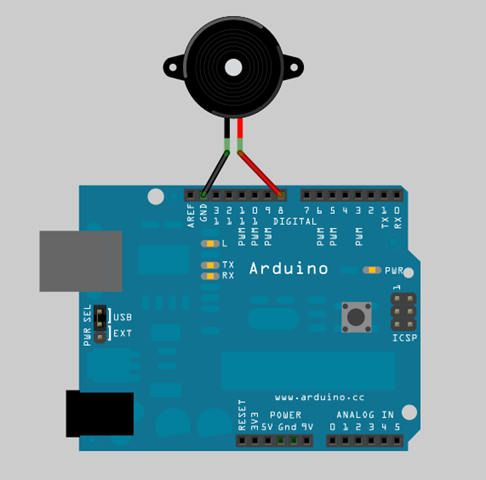
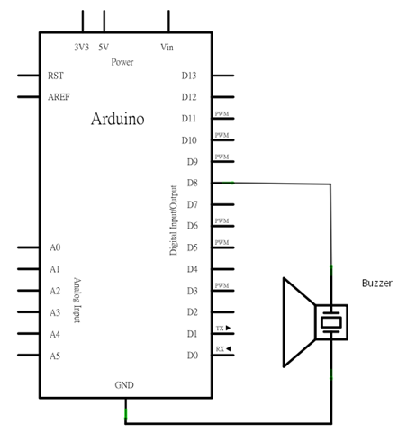

## Arduino入門教學(6) – 控制蜂鳴器發聲 (作者：Cooper Maa)

### 實驗目的

控制蜂鳴器發聲，讓蜂鳴器發出中音 Do(523Hz), Re (587Hz), Mi(659Hz), Fa(698Hz), So(784Hz), La(880Hz), Si(988Hz) 到高音 Do (1047Hz) 這八個不同音階的聲音，每個音階響 0.5 秒鐘。 

### 材料

* Arduino 主板 x 1
* 8 歐姆蜂鳴器 x 1
* 單心線 x n

### 接線

把蜂鳴器接到 Arduino 板子上，紅線(正極)接到 pin8，黑線(負極)接到 GND，如下圖： 
 


電路圖


 
### 程式碼

```CPP
#include "pitches.h"

// notes in the melody:
int melody[] = {
  NOTE_C5, NOTE_D5, NOTE_E5, NOTE_F5, NOTE_G5, NOTE_A5, NOTE_B5, NOTE_C6};
int duration = 500;  // 500 miliseconds

void setup() {

}

void loop() {  
  for (int thisNote = 0; thisNote < 8; thisNote++) {
    // 在 pin8 上輸出聲音&#65292;每個音階響 0.5 秒
    tone(8, melody[thisNote], duration);
    
    // 間隔一段時間後再播放下一個音階
    delay(1000);
  }
  
  // 兩秒後重新播放 
  delay(2000);
}
```

說明： 
* L04~L05: 定義中音 Do, Re, Mi, So, La, Si 及高音 Do 等 8 個音階的頻率，各個音階的頻率已經定義在 pitches.h 檔裏，所以只要找出這八個音階的常數並儲存在 melody 陣列即可。
* L06: 定義 duration 變數，代表每個音階響一次持續的時間，因為要讓每個音階響 0.5 秒，所以把 duration 設為 500 (單位是 milisecond)
* L13~L19: 讓蜂鳴器發出中音 Do(523Hz), Re (587Hz), Mi(659Hz), Fa(698Hz), So(784Hz), La(880Hz), Si(988Hz) 到高音 Do (1047Hz) 這八個不同音階的聲音，每個音階響 0.5 秒鐘
* L22: 隔兩秒鐘後再重新播放

pitches.h 檔的內容: 

```CPP

/*************************************************
 * Public Constants
 *************************************************/

#define NOTE_B0  31
#define NOTE_C1  33
#define NOTE_CS1 35
#define NOTE_D1  37
#define NOTE_DS1 39
#define NOTE_E1  41
#define NOTE_F1  44
#define NOTE_FS1 46
#define NOTE_G1  49
#define NOTE_GS1 52
#define NOTE_A1  55
#define NOTE_AS1 58
#define NOTE_B1  62
#define NOTE_C2  65
#define NOTE_CS2 69
#define NOTE_D2  73
#define NOTE_DS2 78
#define NOTE_E2  82
#define NOTE_F2  87
#define NOTE_FS2 93
#define NOTE_G2  98
#define NOTE_GS2 104
#define NOTE_A2  110
#define NOTE_AS2 117
#define NOTE_B2  123
#define NOTE_C3  131
#define NOTE_CS3 139
#define NOTE_D3  147
#define NOTE_DS3 156
#define NOTE_E3  165
#define NOTE_F3  175
#define NOTE_FS3 185
#define NOTE_G3  196
#define NOTE_GS3 208
#define NOTE_A3  220
#define NOTE_AS3 233
#define NOTE_B3  247
#define NOTE_C4  262
#define NOTE_CS4 277
#define NOTE_D4  294
#define NOTE_DS4 311
#define NOTE_E4  330
#define NOTE_F4  349
#define NOTE_FS4 370
#define NOTE_G4  392
#define NOTE_GS4 415
#define NOTE_A4  440
#define NOTE_AS4 466
#define NOTE_B4  494
#define NOTE_C5  523
#define NOTE_CS5 554
#define NOTE_D5  587
#define NOTE_DS5 622
#define NOTE_E5  659
#define NOTE_F5  698
#define NOTE_FS5 740
#define NOTE_G5  784
#define NOTE_GS5 831
#define NOTE_A5  880
#define NOTE_AS5 932
#define NOTE_B5  988
#define NOTE_C6  1047
#define NOTE_CS6 1109
#define NOTE_D6  1175
#define NOTE_DS6 1245
#define NOTE_E6  1319
#define NOTE_F6  1397
#define NOTE_FS6 1480
#define NOTE_G6  1568
#define NOTE_GS6 1661
#define NOTE_A6  1760
#define NOTE_AS6 1865
#define NOTE_B6  1976
#define NOTE_C7  2093
#define NOTE_CS7 2217
#define NOTE_D7  2349
#define NOTE_DS7 2489
#define NOTE_E7  2637
#define NOTE_F7  2794
#define NOTE_FS7 2960
#define NOTE_G7  3136
#define NOTE_GS7 3322
#define NOTE_A7  3520
#define NOTE_AS7 3729
#define NOTE_B7  3951
#define NOTE_C8  4186
#define NOTE_CS8 4435
#define NOTE_D8  4699
#define NOTE_DS8 4978
```

### 原理

蜂鳴器發聲的原理，其實只是利用 PWM 產生音頻，驅動蜂鳴器，讓空氣產生振動，便能發出聲音。只要適當地改變振動頻率，就可以產生不同音階的聲音。例如，送出 523Hz 的脈波可以產生中音 Do, 587Hz 的脈波可以產生中音 Re, 659Hz 可以產生中音 Mi。如果再搭配不同的節拍，就可以播放一首歌了。這邊要注意不能使用 Arduino 的 analogWrite() 函式產生脈波，因為 analogWrite() 的頻率是固定的(500Hz)，沒辦法輸出不同音階的聲音。

### 動動腦

1. 以這個範例為基礎，加上幾顆 LED 並修改程式，在播放聲音的同時控制 LED 燈號的變化，讓這支範例變成一個具有聲光效果的程式。
2. 試產生救護車的警報聲。提示: 只要讓蜂鳴器不間斷產生中音 Do (523Hz) 和中音 Fa (698Hz) 各約 0.8 秒的聲音，即可模擬救護車的警報聲。

### 延伸閱讀
* [Playing tones on Multiple outputs using the tone() function](http://arduino.cc/en/Tutorial/Tone4)
