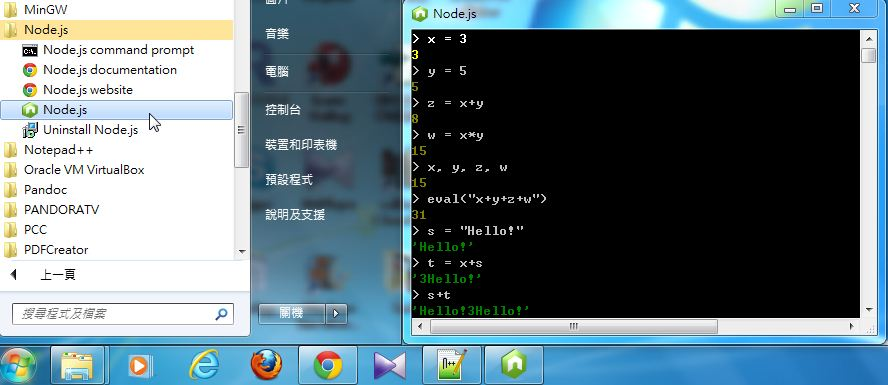

## JavaScript (6) – Node.js 命令列程式設計 (作者：陳鍾誠)

Node.js 通常被用來當成與 PHP、Ruby on Rail 或 ASP.NET 類似的平台，用來撰寫 Web 的網站程式，
但是這種觀點主要是使用 node.js 的 Web 函式庫功能，直接從 Web 程式的實作開始，而非從基礎的 JavaScript 
開始，我們認為這樣的方式並不好，因為入門瓶頸太高，很容易會造成讀者的學習障礙。

事實上、Node.js 當中包含了一個由 Google Chrome 計畫中所釋出的 JavaScript 編譯引擎 -- V8，這是一個
速度很快的 JavaScript 執行工具，在本章中，我們將從命令列基本操作開始，將 node.js 單純當作一個 JavaScript 
解譯器使用，以便透過 node.js 進一步學習 JavaScript 的語法與基本函式庫的用法。

### Node.js 的安裝

本文使用 node.js 0.10.0 版示範，您可以從 node.js 官網上下載到最新的版本，以下是 node.js 的網址。

* <http://nodejs.org/>

node.js 0.10 之後的版本，在 windows 當中的安裝非常容易，只要一直點選下一步，就能完全安裝完畢。

### Node.js 的互動操作環境

安裝完 Node.js 之後，您就可以啟動 Node.js 的互動操作環境，然後開始輸入一些基本的 JavaScript 程式，以便學習 JavaScript 的語法，以下是筆者的一個操作畫面。



```javascript
> x = 3
3
> y = 5
5
> z = x+y
8
> w = x*y
15
> x, y, z, w
15
> eval("x+y+z+w")
31
> s = "Hello!"
'Hello!'
> t = x+s
'3Hello!'
> s+t
'Hello!3Hello!'
> score = 80
80
> add = function(a,b) { return a+b; }
[Function]
> add(3,5)
8
> add(374, 567)
941
> sum = function(n) {
... s = 0;
... for (i=1; i<=n; i++)
...   s += i;
... return s
... }
[Function]
> sum(10)
55
> sum(100)
5050
> max = function(a,b) {
... if (a>b)
...   return a;
... else
...   return b;
... }
[Function]
> max(3,5)
5
> max(9,2)
9
```

從以上的操作中，您可以看到我們不只可以進行基本的運算操作，也可以直接在裏面定義函數，以及呼叫這些函數。

當然、您也可以將 JavaScript 的程式存檔，然後用 node.js 去執行，

#### Node.js 的命令列工具

雖然互動操作環境感覺很方便，但是要撰寫真正的程式時，就不太好用了，此時您可以使用 Node 的
命令列工具 -- Node.js command prompt 來執行程式。舉例而言，我們可以先撰寫了一個 hello.js 的程式，
如下所示：

檔案：hello.js

```javascript
console.log("Hello!");
```

然後啟動 Node.js command prompt 去執行該程式，以下是我們的執行 hello.js 與下述 sum.js 程式的結果：


檔案：sum.js

```javascript
function sum(n) {
  var s = 0;
  for (i=1; i<=n; i++)
    s+=i;
  return s;
}

console.log("sum(10)="+sum(10));

console.log("sum(100)="+sum(100));
```

於是、透過 Node.js 的開發環境，我們可以將原本只能在瀏覽器中測試的 JavaScript 程式，
放到 Node.js 當中執行，這樣就能更方便的學習 JavaScript 的語法與函式庫，大大的提高了
我們學習 JavaScript 的方便程度。

目前、筆者在撰寫 JavaScript 程式時，通常會先用 Node.js 進行測試，沒有問題之後，在放到
瀏覽器當中去執行，也就是將 Node.js 當作單元測試的工具，這對筆者的幫助很大。

接著、讓我們透過 Node.js 平台，來學習一些 JavaScript 基本函式庫的用法，首先讓我們來看看
動態解譯函數 eval()。

### Eval 函數

Eval 函數可以用來執行任何 JavaScript 程式碼，這是解譯式語言特有的函數，以下是一個使用 eval() 函數的程式範例。

檔案：eval.js

```javascript
x = 3;
y = 5;
console.log("eval('x+y')="+eval('x+y'));

function max(x,y) { 
    return (x>y)?x:y; 
}

console.log("eval('max')="+eval('max'));

console.log("eval('max(x,y)')="+eval('max(x,y)'));

console.log("eval('max(2*x,y)')="+eval('max(2*x,y)'));

```

執行結果：

```
D:\code\node>node eval.js
eval('x+y')=8
eval('max')=function max(x,y) {
    return (x>y)?x:y;
}
eval('max(x,y)')=5
eval('max(2*x,y)')=6

```

雖然 eval() 通常是在解釋環境之下才具備的功能，但是在 Node.js 這種動態編譯環境之下，
卻也能夠順利的執行，這對那些開發 C/C++, Java, C# 等語言的程式人員而言，勢必會感到
非常的羨慕才對。

註：如果您曾經在資料結構的課程上，嘗試去寫運算式處理的中序轉前序程式，只是為了計算
運算式的值，就會知道這樣的功能在那些編譯式語言當中是多麼的難寫，而要寫一個支援任意
運算式執行的程式，基本上就是重新撰寫一個語言解譯器，那就相當於重新建造了整套開發工具，
這是非常非常困難的。

接著、讓我們來看看 Node.js 當中的一些重要的函式庫與觀念，包含「輸出入、檔案、以及模組的定義與引用等」。

### 讀取檔案

程式：readfile.js

```javascript
var fs = require('fs'); // 引用檔案物件
var file = fs.readFileSync(process.argv[2], "utf8"); // 讀取檔案
console.log(file); // 顯示在螢幕上
```

執行結果

```
D:\code\node>node readfile.js readfile.js
var fs = require('fs'); // 引用檔案物件
var file = fs.readFileSync(process.argv[2], "utf8"); // 讀取檔案
console.log(file); // 顯示在螢幕上
```

### 寫入檔案

我們用複製檔案的程式來示範寫入檔案的功能。

程式：copyfile.js

```javascript
var fs = require('fs');
var file = fs.readFileSync(process.argv[2]);
console.log(file);
fs.writeFileSync(process.argv[3], file);
```

執行結果：

```
D:\code\node>node copyfile.js copyfile.js copyfile.js.bak
<Buffer 76 61 72 20 66 73 20 3d 20 72 65 71 75 69 72 65 28 27 66 73 27 29 3b 0a
76 61 72 20 66 69 6c 65 20 3d 20 66 73 2e 72 65 61 64 46 69 6c 65 53 79 6e 63 28
 ...>
```

### 模組定義與引用

當您用 javascript 寫出物件或函式庫時，可以提供給其他程式使用。

在 node.js 當中，模組的定義大致有兩種類型，一種是「匯出物件」的靜態模組，另一種是匯出「建構函數」的動態模組。

#### 靜態模組：匯出物件

以下是一個匯出物件的靜態模組定義。

模組定義：circle.js

```javascript
var math = {
    PI:3.14,
    square:function(n) {
        return n*n;
    }
}

module.exports = math;

```

接著您可以使用 require 這個指令動態的引入該模組，注意 require 必須採用相對路徑，即使在同一個資料夾底下，也要加上 ./ 的前置符號，代表在目前資料夾之下。以下是一個引用上述模組的範例。

模組使用：CircleTest.js

```javascript
var m=require("./math");

console.log("PI=%d square(3)=%d", m.PI, m.square(3));
```

執行結果：

```
D:\Dropbox\Public\pmag\201306\code>node mathTest
PI=3.14 square(3)=9

```

#### 動態模組：匯出建構函數

以下是一個定義圓形 circle 的物件。

模組定義：circle.js

```javascript
var PI = 3.14;
Circle = function (radius) {
    this.radius = radius
    this.area = function() {
        return PI * this.radius * this.radius;
    }
};

module.exports = Circle;
module.exports.PI = PI;

```

在引用「匯出建構函數」的程式當中，由於取得的是建構函數，因此必須再使用 new 的方式建立物件之後才能使用 
(例如以下的 `c = new cir(5)` 這個指令，就是在透過建構函數 `cir()` 建立物件。

模組使用：CircleTest.js

```javascript
var cir = require('./circle');  			// 注意，./ 代表 circle 與此程式放在同一個資料夾底下。
var c = new cir(5);
console.log("cir.PI="+cir.PI);
console.log("c.PI="+c.PI);
console.log("c.area()="+c.area());

```

執行結果

```
D:\code\node>node circleTest.js
cir.PI=3.14
c.PI=undefined
c.area()=78.5
```

您現在應該可以理解為何我們要將 Circle 定義為一個函數了吧！這只不過 Circle 類別的建構函數而已，
當他被 module.exports = Circle 這個指令匯出時，就可以在 var cir = require('./circle') 這個指令
接收到建構函數，然後再利用像 `var c = new cir(5)` 這樣的指令，呼叫該建構函數，以建立出物件。

然後，您也應該可以看懂為何我們要用 module.exports.PI = PI 將 PI 獨立塞到 module.exports 裏了吧！
因為只有這樣才能讓外面的模組在不執行物件建構函數 (不建立物件) 的情況之下就能存取 PI。

#### 跨平台模組：定義各種平台均能使用的 JavaScript 模組

在很多開放原始碼的 JavaScript 專案模組中，我們會看到模組的最後有一段很複雜的匯出動作。舉例而言，
在 marked.js 這個將 Markdown 語法轉為 HTML 的模組最後，我們看到了下列這段感覺匪夷所思的匯出橋段，
這種寫法其實只是為了要讓這個模組能夠順利的在「瀏覽器、node.js、CommonJS 與其 Asynchronous 
Module Definition (AMD) 實作版的 RequireJS」等平台當中都能順利的使用這個模組而寫的程式碼而已。

```javascript

/**
 * Expose
 */

marked.Parser = Parser;
marked.parser = Parser.parse;

marked.Lexer = Lexer;
marked.lexer = Lexer.lex;

marked.InlineLexer = InlineLexer;
marked.inlineLexer = InlineLexer.output;

marked.parse = marked;

if (typeof exports === 'object') {
  module.exports = marked;
} else if (typeof define === 'function' && define.amd) {
  define(function() { return marked; });
} else {
  this.marked = marked;
}

}).call(function() {
  return this || (typeof window !== 'undefined' ? window : global);
}());
```

對這個超複雜匯出程式有興趣的朋友可以看看以下的文章，應該就可以大致理解這種寫法的來龍去脈了。

* <http://www.angrycoding.com/2012/10/cross-platform-wrapper-function-for.html>

### 參考文獻
* Node.js 台灣社群協作電子書 -- <http://book.nodejs.tw/>
* Node入門 -- <http://www.nodebeginner.org/index-zh-tw.html>
* 深入浅出Node.js相关的内容 -- <http://www.infoq.com/cn/master-nodejs>
    * 深入浅出Node.js（一）：什么是Node.js -- <http://www.infoq.com/cn/articles/what-is-nodejs>
    * 深入浅出Node.js（三）：深入Node.js的模块机制 -- <http://www.infoq.com/cn/articles/nodejs-module-mechanism>
* node.js 檔案讀取 -- http://book.nodejs.tw/zh-tw/node_basic.html#id2
* <http://stackoverflow.com/questions/2496710/nodejs-write-to-file>
* Node.js, Require and Exports
    * <http://openmymind.net/2012/2/3/Node-Require-and-Exports/>
* Node.js v0.8.5 Manual & Documentation/Modules
    * <http://nodejs.org/api/modules.html#modules_modules>
* Understanding Node.js' "require"
    * <http://jherdman.github.com/2010-04-05/understanding-nodejs-require.html>
