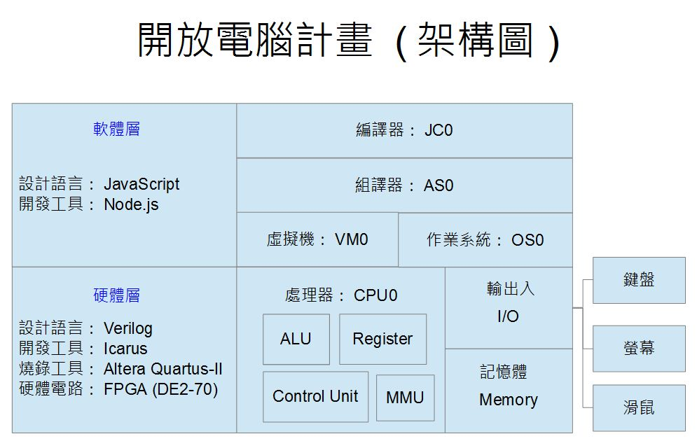
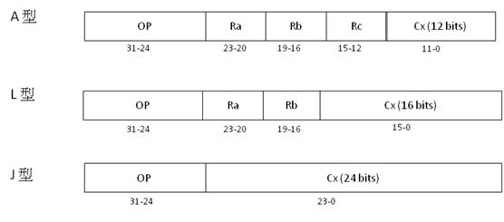

## 開放電腦計畫 (1) – 整體架構與 CPU0 處理器 (作者：陳鍾誠)

如果您是資工系畢業的學生，必然會上過「計算機結構、編譯器、作業系統、系統程式、組合語言」等等課程，
這些課程都是設計出一台電腦所必需的基本課程。但是如果有人問您「您是否會設計電腦呢？」，相信大部分人
的回答應該是：「我不會，也沒有設計過」。

光是設計一個作業系統，就得花上十年的工夫，遑論還要自己設計「CPU、匯流排、組譯器、編譯器、作業系統」
等等。因此，我們都曾經有過這樣的夢想，然後在年紀越大，越來越瞭解整個工業結構之後，我們就放棄了這樣
一個夢想，因為我們必須與現實妥協。

但是，身為一個大學教師，我有責任教導學生，告訴他們「電腦是怎麼做出來的」，因此我不自量力的提出了
這樣一個計畫，那就是「開放電腦計畫」，我們將以「千里之行、始於足下」的精神，設計出一台全世界最簡單
且清楚的「電腦」，包含「軟體與硬體」。

### 開放電腦計畫簡介

從 2007 年我開始寫「系統程式」這本書以來，就有一個想法逐漸在內心發酵，
這個想法就是：「我想從 CPU 設計、組譯器、虛擬機、編譯器到作業系統」，自己打造一台電腦！

筆者曾經在「系統程式」一書當中，用 C 語言實作 CPU0 的「組譯器、虛擬機、編譯器」等程式，有興趣的讀者可以參考該書，
該書的程式碼可以從以下網址下載。

* <http://sp1.wikidot.com/main>

然而、使用 C 語言設計時，程式碼還是會比較長，比較難以理解其設計的邏輯，為了更符合「開放電腦計畫」的 
KISS (Keep it Simple and Stupid) 原則，我們決定改用 JavaScript 設計開放電腦計畫的軟體部分，改寫後發現
可以將程式碼減少到只剩 1/3。

在「實用」、「效能」與「簡單」這些令人為難的選擇當中，我們選擇了「後者」，將設計極度的簡化，不考慮「效能」
與「商業競爭力」等問題，甚至在實用性上進行了不少妥協，一律採用「容易理解」為最高指導原則，設計出這台電腦。

在本系列文章當中，我們將會使用 JavaScript 打造軟體的部分，然後用 Verilog 打造硬體的部分，以下是本系列文章中
的「開放電腦」架構圖。



除此之外、「系統程式」一書的實作與「開放電腦計畫的目標」之間，仍然不少的距離，像是程式碼不夠精簡、錯誤回報功能太差、
沒有實做 CPU 等硬體、編譯器不支援函數呼叫，沒有寫出作業系統等等，我們也將在此系列文章當中一並改進！

目前開放電腦計劃的程式碼已經上傳到 dropbox 與 github 上，您可以從下列網址檢視並取得這些程式碼：

* <https://dl.dropboxusercontent.com/u/101584453/oc/code.zip>

我們希望能在這個系列的文章裏，盡可能實現「自己動手打造電腦」的夢想！

但是、在筆者的構想當中，開放電腦計畫重要的並不是那些程式碼，而是一本「將電腦從下到上都說明的很清楚的書」，
只要您看完這樣一本書，而且具有足夠的軟硬體程式能力，就能夠「自己打造出一台電腦」。

而「程式人雜誌」刊出的這一系列文章，將會是「開放電腦計畫」這本書的核心內容！

但是即便如此，對於沒有設計過電腦的人而言，很多部分仍然無法只用一個程式就說明清楚，此時我們會將這個已經
非常簡化的程式再細分成幾個版本。

舉例而言，在 CPU 的設計上，我們採用一種極度簡化的 32 位元處理器 (CPU0) (由於採用四位元一組的編碼方式，您
可以輕易的用 16 進位手工寫出 CPU0 的機器碼)，這樣的設計有助於讀者清楚的理解 CPU0 的結構，降低理解的困難度。

接著我們會採用 Verilog 設計出 CPU0 的電路，但是為了更容易理解起見，我們將 CPU0 的實作又進一步細分成下列版本。

版本                程式名稱            說明
------------        ---------------     --------------------------------------------------------------------------------------------------
微型流程版          cpu0m.v             只實作 CPU0 中 3 個指令的處理器 (LD, ADD, JMP) -- 採用最簡單的流程設計方式。
微型方塊版          cpu0mb.v            只實作 CPU0 中 3 個指令的處理器 (LD, ADD, JMP) -- 將 ALU, 暫存器與控制單元模組化後的版本。
微型管線版          cpu0mp.v            只實作 CPU0 中 3 個指令的處理器 (LD, ADD, JMP) -- 採用管線 (Pipeline) 的設計方式。
簡易完整版          cpu0s.v             實作 CPU0 的所有指令，但是不具被中斷機制。
中斷機制版          cpu0i.v             實作 CPU0 的所有指令，包含中斷機制。
浮點運算版          cpu0f.v             在 CPU0 當中加入浮點數的支援。

即便已經有了一些實作，但這些實作很多是太過陽春了，不過開放電腦計畫其實是一個無止境的計劃，當我們完成一個階段之後，下一個階段
又會開始，到目前為止，我們完成了上述架構中大部分元件的陽春版 (除了 MMU 尚未實作之外、OS0 目前也無法稱得上是一個作業系統，只能說是
一個行程切換 「Task Switching」 範例而已)。

接著我們將參考 UNIXv6, L4 等作業系統，建構更完整的 OS0，也將研究 QEMU 等虛擬機，建構出更快速完整的虛擬機。當然，針對編譯器、
組譯器等，也都還有很多研究空間，等待著我們去探索。

### CPU0 處理器

CPU0 是一個簡易的32 位元處理器，其架構如下圖所示，包含R0..R15, IR, MAR, MDR 等暫存器，其中 IR是指令暫存器，
R0 是一個永遠為常數 0 的唯讀暫存器，R15 是程式計數器 (Program Counter : PC)，R14 是連結暫存器 (Link Register : LR)，
R13 是堆疊指標暫存器 (Stack Pointer : SP)，而 R12 是狀態暫存器 (Status Word : SW)。


#### CPU0 的指令集

CPU0 包含『載入儲存』、『運算指令』、『跳躍指令』、『堆疊指令』等四大類指令，以下表格是 CPU0 的指令編碼表，記載了 CPU0 的指令集與每個指令的編碼。

格式    指令        OP      說明                     語法                       語意
-----   ---------   ------  ---------------------    --------------------       ---------------------
L       LD          00      載入word                 LD  Ra, [Rb+Cx]             Ra=[Rb+Cx]
L       ST          01      儲存word                 ST  Ra, [Rb+Cx]             Ra=[Rb+Cx]
L       LDB         02      載入 byte                LDB Ra, [Rb+Cx]             Ra=(byte)[Rb+Cx]
L       STB         03      儲存 byte                STB Ra, [Rb+Cx]             Ra=(byte)[Rb+Cx]
A       LDR         04      LD的暫存器版             LDR Ra, [Rb+Rc]             Ra=[Rb+Rc]
A       STR         05      ST的暫存器版             STR Ra, [Rb+Rc]             Ra=[Rb+Rc]
A       LBR         06      LDB的暫存器版            LBR Ra, [Rb+Rc]             Ra=(byte)[Rb+Rc]
A       SBR         07      STB的暫存器版            SBR Ra, [Rb+Rc]             Ra=(byte)[Rb+Rc]
L       LDI         08      載入常數                 LDI Ra, Cx                  Ra=Cx
A       CMP         10      比較                     CMP Ra, Rb                  SW=Ra >=< Rb
A       MOV         12      移動                     MOV Ra, Rb                  Ra=Rb
A       ADD         13      加法                     ADD Ra, Rb, Rc              Ra=Rb+Rc
A       SUB         14      減法                     SUB Ra, Rb, Rc              Ra=Rb-Rc
A       MUL         15      乘法                     MUL Ra, Rb, Rc              Ra=Rb*Rc
A       DIV         16      除法                     DIV Ra, Rb, Rc              Ra=Rb/Rc
A       AND         18      邏輯 AND                 AND Ra, Rb, Rc              Ra=Rb and Rc
A       OR          19      邏輯 OR                  OR Ra, Rb, Rc               Ra=Rb or Rc
A       XOR         1A      邏輯 XOR                 XOR Ra, Rb, Rc              Ra=Rb xor Rc
A       ADDI        1B      常數加法                 ADDI Ra, Rb, Cx             Ra=Rb + Cx
A       ROL         1C      向左旋轉                 ROL Ra, Rb, Cx              Ra=Rb rol Cx
A       ROR         1D      向右旋轉                 ROR Ra, Rb, Cx              Ra=Rb ror Cx
A       SHL         1E      向左移位                 SHL Ra, Rb, Cx              Ra=Rb << Cx
A       SHR         1F      向右移位                 SHR Ra, Rb, Cx              Ra=Rb >> Cx
J       JEQ         20      跳躍 (相等)              JEQ Cx                      if SW(=)  PC=PC+Cx
J       JNE         21      跳躍 (不相等)            JNE Cx                      if SW(!=) PC=PC+Cx
J       JLT         22      跳躍 (<)                 JLT Cx                      if SW(<)  PC=PC+Cx
J       JGT         23      跳躍 (>)                 JGT Cx                      if SW(>)  PC=PC+Cx
J       JLE         24      跳躍 (<=)                JLE Cx                      if SW(<=) PC=PC+Cx
J       JGE         25      跳躍 (>=)                JGE Cx                      if SW(>=) PC=PC+Cx
J       JMP         26      跳躍 (無條件)            JMP Cx                      PC=PC+Cx
J       SWI         2A      軟體中斷                 SWI Cx                      LR=PC; PC=Cx; INT=1
J       CALL        2B      跳到副程式               CALL Cx                     LR=PC; PC=PC+Cx
J       RET         2C      返回                     RET                         PC=LR
J       IRET        2D      中斷返回                 IRET                        PC=LR; INT=0
A       PUSH        30      推入word                 PUSH Ra                     SP-=4; [SP]=Ra;
A       POP         31      彈出 word                POP Ra                      Ra=[SP]; SP+=4;
A       PUSHB       32      推入 byte                PUSHB Ra                    SP--; [SP]=Ra; (byte)
A       POPB        33      彈出 byte                POPB Ra                     Ra=[SP]; SP++; (byte)

#### CPU0 指令格式

CPU0 所有指令長度均為 32 位元，這些指令也可根據編碼方式分成三種不同的格式，分別是 A 型、J 型與 L 型。

大部分的運算指令屬於A (Arithmatic) 型，而載入儲存指令通常屬於 L (Load & Store) 型，跳躍指令則通常屬於 J (Jump) 型，
這三種型態的指令格式如下圖所示。



#### 狀態暫存器

R12 狀態暫存器 (Status Word : SW) 是用來儲存 CPU 的狀態值，這些狀態是許多旗標的組合。例如，零旗標 (Zero，簡寫為Z) 
代表比較的結果為 0，負旗標 (Negative ，簡寫為N) 代表比較的結果為負值，另外常見的旗標還有進位旗標 (Carry ，簡寫為 C)，
溢位旗標 (Overflow，簡寫為 V) 等等。下圖顯示了 CPU0 的狀態暫存器格式，最前面的四個位元 N、Z、C、V所代表的，
正是上述的幾個旗標值。


條件旗標的 N、Z 旗標值可以用來代表比較結果是大於 (>)、等於 (=) 還是小於 (<)，當執行 CMP Ra, Rb 動作後，會有下列三種可能的情形。

1. 若 Ra > Rb，則 N=0, Z=0。
2. 若 Ra < Rb，則 N=1, Z=0。
3. 若 Ra = Rb，則 N=0, Z=1。

如此，用來進行條件跳躍的 JGT、JGE、JLT、JLE、JEQ、JNE指令，就可以根據 SW 暫存器當中的 N、Z 等旗標決定是否進行跳躍。

SW 中還包含中斷控制旗標 I (Interrupt) 與 T (Trap)，用以控制中斷的啟動與禁止等行為，假如將 I 旗標設定為 0，則CPU0將禁止所有種類的中斷，也就是對任何中斷都不會起反應。但如果只是將 T 旗標設定為0，則只會禁止軟體
中斷指令 SWI (Software Interrupt)，不會禁止由硬體觸發的中斷。

SW 中還儲存有『處理器模式』的欄位，M=0 時為『使用者模式』 (user mode) 與 M=1 時為『特權模式』(super mode) 等，
這在作業系統的設計上經常被用來製作安全保護功能。在使用者模式當中，任何設定狀態暫存器 R12 的動作都會被視為是非法的，
這是為了進行保護功能的緣故。但是在特權模式中，允許進行任何動作，包含設定中斷旗標與處理器模式等位元，
通常作業系統會使用特權模式 (M=1)，而一般程式只能處於使用者模式 (M=0)。

#### 位元組順序 

CPU0 採用大者優先 (Big Endian) 的位元組順序 (Byte Ordering)，因此代表值越大的位元組會在記憶體的前面 (低位址處)，代表值小者會在高位址處。

由於 CPU0 是 32 位元的電腦，因此，一個字組 (Word) 占用 4 個位元組 (Byte)，因此，像 LD R1, [100] 這樣的指令，其實是將記憶體 100-103 中的字組取出，存入到暫存器 R1 當中。

LDB 與 STB 等指令，其中的 B 是指 Byte，因此，LDB R1, [100] 會將記憶體 100 中的 byte 取出，載入到 R1 當中。但是，由於 R1 的大小是 32 bits，相當於 4個 byte，此時，LDB 與 STB 指令到底是存取四個 byte 當中的哪一個byte呢？這個問題的答案是byte 3，也就是最後的一個 byte。 


#### 中斷程序

CPU0 的中斷為不可重入式中斷，其中斷分為軟體中斷 SWI (Trap) 與硬體中斷 HWI (Interrupt) 兩類。

硬體中斷發生時，中段代號 INT_ADDR 會從中段線路傳入，此時執行下列動作：

1. LR=PC; INT=1
2. PC=INT_ADDR

軟體中斷 SWI Cx 發生時，會執行下列動作：

1. LR=PC; INT=1
2. PC=Cx; 

中斷最後可以使用 IRET 返回，返回前會設定允許中斷狀態。

1. PC=LR; INT=0

### CPU0 的組合語言與機器碼

接著、讓我們從組合語言的角度，來看看 CPU0 處理器的設計，以下是一個可以計算 `1+2+...+10` 的程式，
計算完成之後會透過呼叫軟體中斷 SWI 程序 (類似 DOS 時代的 INT 中斷)，在螢幕上印出下列訊息。

```
1+...+10=55
```

以下的檔案 sum.as0 正是完成這樣功能的一個 CPU0 組合語言程式。

檔案：sum.as0

```
        LD     R1, sum      ; R1 = sum = 0
        LD     R2, i        ; R2 = i = 1
        LDI    R3, 10       ; R3 = 10
FOR:    CMP    R2, R3       ; if (R2 > R3)
        JGT    EXIT         ;   goto EXIT
        ADD    R1, R1, R2   ; R1 = R1 + R2 (sum = sum + i)
        ADDI   R2, R2, 1    ; R2 = R2 + 1  ( i  = i + 1)
        JMP    FOR          ; goto FOR
EXIT:   ST     R1, sum      ; sum = R1
        ST     R2, i        ; i = R2
        LD     R9, msgptr   ; R9= pointer(msg) = &msg
        SWI    3            ; SWI 3 : 印出 R9 (=&msg) 中的字串
        MOV    R9, R1       ; R9 = R1 = sum
        SWI    4            ; SWI 4 : 印出 R9 (=R1=sum) 中的整數
        RET                 ; return 返回上一層呼叫函數
i:      RESW   1            ; int i
sum:    WORD   0            ; int sum=0
msg:    BYTE   "1+...+10=", 0   ; char *msg = "sum="
msgptr: WORD   msg          ; char &msgptr = &msg
```

我們可以用以下指令呼叫「組譯器 AS0」對上述檔案進行組譯：

```
node as0 sum.as0 sum.ob0
```

上述的程式經過組譯之後，會輸出組譯報表，如下所示。

sum.as0 的組譯報表

```
0000          LD       R1,sum           L 00 001F003C
0004          LD       R2,i             L 00 002F0034
0008          LDI      R3,10            L 08 0830000A
000C FOR      CMP      R2,R3            A 10 10230000
0010          JGT      EXIT             J 23 2300000C
0014          ADD      R1,R1,R2         A 13 13112000
0018          ADDI     R2,R2,1          A 1B 1B220001
001C          JMP      FOR              J 26 26FFFFEC
0020 EXIT     ST       R1,sum           L 01 011F001C
0024          ST       R2,i             L 01 012F0014
0028          LD       R9,msgptr        L 00 009F0022
002C          SWI      3                J 2A 2A000003
0030          MOV      R9,R1            A 12 12910000
0034          SWI      2                J 2A 2A000002
0038          RET                       J 2C 2C000000
003C i        RESW     1                D F0 00000000
0040 sum      WORD     0                D F2 00000000
0044 msg      BYTE     "1+...+10=",0    D F3 312B2E2E2E2B31303D00
004E msgptr   WORD     msg              D F2 00000044
```

最後「組譯器 AS0」會輸出機器碼到目的檔 sum.ob0 當中，其內容如下所示。

sum.as0 的機器碼 (以 16 進位顯示)

```
001F003C 002F0034 0830000A 10230000
2300000C 13112000 1B220001 26FFFFEC
011F001C 012F0014 009F0022 2A000003
12910000 2A000002 2C000000 00000000
00000000 312B2E2E 2E2B3130 3D000000
0044
```

如果我們用「虛擬機 VM0」去執行上述的目的檔 sum.ob0，會看到程式的執行結果，是在
螢幕上列印出 `1+...+10=55`，以下是我們的操作過程。

```
1+...+10=55
```

### CPU0 指令表的定義：使用 JavaScript+Node.js

雖然 CPU0 處理器按理講應該直接以硬體實作，但是我們恐怕不容易直接請「台積電」或「聯電」幫我們燒一顆，因此在實作上我們會用
FPGA + Verilog + Altera DE2-70 進行 CPU 設計。

但是在此之前，我們會先設計出「虛擬機+組譯器」，以便讓「程式人雜誌」的讀者能從軟體角度理解其設計，我們將在 7 月號
詳細說明組譯器「AS0.js 」的實作方法，然後在 8 月號刊出虛擬機「VM0.js」的原始碼與說明文章。

現在、我們將先列出「虛擬機 AS0」與「組譯器 VM0」都會用到的共同部分，也就是「處理器 CPU0.js」與「指令表 opTable.js」
兩個程式的原始碼，並講解程式內容與執行結果。

在 JavaScript 當中要設計出指令表 opTable.js 非常的簡單，因為 JavaScript 的物件本身就是個符號表，
因此我們只要用 `this[op.name] = op` 這行指令就能在 opTable 這個建構函數當中，將指令物件插入到表格內。

檔案：opTable.js

```javascript
var c = require("./ccc");

var Op = function(line) {
    var tokens = line.split(/\s+/);
    this.name = tokens[0];
    this.id   = parseInt(tokens[1], 16);
    this.type = tokens[2];
}

var opTable = function(opList) {
  for (i in  opList) {
    var op = new Op(opList[i]);
    this[op.name] = op;
  }  
}

opTable.prototype.ID = function(op) { 
  return this[op].id; 
}

opTable.prototype.dump=function() {
    for (key in this) {
      var op = this[key];
      if (typeof(op)!="function")
        c.log("%s %s %s", c.fill(' ', op.name, 8), c.hex(op.id, 2), op.type);
    }
}

module.exports = opTable;

```

在上述程式碼中，每個指令包含了「指令名稱 (name), 指令代碼 (id) 與指令型態 (type)」等三個欄位，舉例而言，當
一個載入指令的字串定義為 `"LD 00 L"` 時，就會被函數 `Op = function(line)` 拆解為 { name="LD", id=0x00, type="L" } 
這樣的物件，然後新增到指令表當中。

利用上述的 opTable.js，我們可以輕易的建構出 CPU0 處理器的指令表，以下是 cpu0.js 程式的原始碼，該程式建構出了
CPU0 的完整指令表，包含 「LD, ST, ....., PUSHB, POPB」等真實的指令。

另外、以下表格當中還包含了「RESW, RESB, WORD, BYTE」等資料定義假指令，其中 RESW 用來保留 n 個 Word，RESB 用來保留 n 個 BYTE，
WORD 則用來定義有初始值的整數變數，BYTE 則用來定義有初始值的位元組變數，像是 8 位元整數或字串等。

檔案：cpu0.js

```javascript
var opTable = require("./optable");
var opList = [ "LD 00 L", "ST  01 L", "LDB 02 L",  "STB 03 L", "LDR 04 L", 
"STR 05 L", "LBR 06 L",  "SBR 07 L",  "LDI 08 L", "CMP 10 A", "MOV 12 A", 
"ADD 13 A",  "SUB 14 A",  "MUL 15 A", "DIV 16 A",  "AND 18 A", "OR  19 A",  "XOR 1A A",  
"ADDI 1B A", "ROL 1C A",  "ROR 1D A", "SHL 1E A", "SHR 1F A",  
"JEQ 20 J", "JNE 21 J",  "JLT 22 J", "JGT 23 J", "JLE 24 J",  "JGE 25 J", "JMP 26 J", 
"SWI 2A J", "JSUB 2B J","RET 2C J", "PUSH 30 J", "POP 31 J",  "PUSHB 32 J", 
"POPB 33 J", "RESW F0 D", "RESB F1 D", "WORD F2 D", "BYTE F3 D"];

var cpu = { "opTable" : new opTable(opList) };

cpu.opTable.dump();

module.exports = cpu;

```

執行結果：

```
D:\Dropbox\Public\oc\code>node cpu0.js
LD       00 L
ST       01 L
LDB      02 L
STB      03 L
LDR      04 L
STR      05 L
LBR      06 L
SBR      07 L
LDI      08 L
CMP      10 A
MOV      12 A
ADD      13 A
SUB      14 A
MUL      15 A
DIV      16 A
AND      18 A
OR       19 A
XOR      1A A
ADDI     1B A
ROL      1C A
ROR      1D A
SHL      1E A
SHR      1F A
JEQ      20 J
JNE      21 J
JLT      22 J
JGT      23 J
JLE      24 J
JGE      25 J
JMP      26 J
SWI      2A J
JSUB     2B J
RET      2C J
PUSH     30 J
POP      31 J
PUSHB    32 J
POPB     33 J
RESW     F0 D
RESB     F1 D
WORD     F2 D
BYTE     F3 D

```

細心的讀者可能會注意到，我們在 opTable.js 當中引入了 ccc.js 這個函式庫，這個函式庫是「開放電腦計畫」當中的常用函數集合，
其原始碼如下所示。

```javascript
var util = require("util");
var assert = require("assert");
var fs = require("fs");

var c = {};                 // 本模組的傳回物件
c.log = console.log;        // 將 console.log 名稱縮短一點
c.format = util.format;     // 字串格式化
c.assert = assert.ok;       // assert 函數，若不符合條件則程式會停止
c.bits = function(word, from, to) { return word << (31-to) >>> (31-to+from); }      // 取得 from 到 to 之間的位元
c.signbits = function(word, from, to) { return word << (31-to) >> (31-to+from); }   // 取得 from 到 to 之間的位元
c.nonull = function(o) { if (o == null) return ""; else return o; }                 // 將 null 改為空字串傳回

c.space = "                                                                      "; // 空白字串，dup() 函數中使用到的。
c.dup = function(ch, n) {           // 傳回 ch 重複 n 次的字串；範例：dup('x', 3) = 'xxx'
  assert.ok(n < c.space.length);
  return c.space.substr(0, n).replace(/ /g, ch); 
}

c.fill = function(ch, o, len) {     // 將字串填滿 ch，例如：fill(' ', 35, 5) = '35   '; fill('0', 35, -5) = '00035';
  var str = o.toString();
  if (len >= 0)
    return str+c.dup(ch, len-str.length);
  else
    return c.dup(ch, -len-str.length)+str;
}

c.base = function(n, b, len) {      // 將數字 n 轉換為以 b 為基底的字串；例如：base(31, 16, 5) = '0001F';
  var str = n.toString(b);
  return c.dup('0', len-str.length)+str;
}

c.hex = function(n, len) {          // 將數字 n 轉換 16 進位；例如：hex(31, 5) = '0001F'; hex(-3, 5) = 'FFFFD'
  var str = (n < 0 ? (0xFFFFFFFF + n + 1) : n).toString(16).toUpperCase();
  if (n < 0)
    return c.fill('F', str, -len).substr(-len);
  else
    return c.fill('0', str, -len).substr(-len);
}

c.str2hex = function(str) {         // 將字串轉為 16 進位碼，例如：str2hex('Hello!') = '48656C6C6F21'
  var hex="";
  for (i=0; i<str.length; i++) {
    var code = str.charCodeAt(i);
    hex += c.hex(code, 2);
  }
  return hex;
}

c.error = function(msg, err) {
   c.log(msg);
   c.log("Error : (%s):%s", err.name, err.message);
   c.log(err.stack);
   process.exit(1);
}

c.test = function() {
  c.log("bits(0xF3A4, 4, 7)=%s", c.hex(c.bits(0xF3A4, 4, 7), 4));
  c.log("dup('x', 3)=%s", c.dup('x', 3));
  c.log("fill('0', 35, -5)=%s", c.fill('0', 35, -5));
  c.log("base(100, 16, 5)=%s", c.base(100, 16, 5));
  c.log("hex(-100)=%s", c.hex(-100, 6));
  c.log("str2hex(Hello!)=%s", c.str2hex("Hello!"));
}

c.test();

module.exports = c;

```

以上程式的單元測試 c.test() 執行結果如下

```
D:\Dropbox\Public\oc\code>node ccc
bits(0xF3A4, 4, 7)=000A
dup('x', 3)=xxx
fill('0', 35, -5)=00035
base(100, 16, 5)=00064
hex(-100)=FFFF9C
str2hex(Hello!)=48656C6C6F21
```

### 參考文獻
* 系統程式 (陳鍾誠著, 旗標出版社) -- <http://sp1.wikidot.com/main>
* [JavaScript (6) – Node.js 命令列程式設計](https://dl.dropboxusercontent.com/u/101584453/pmag/201306/htm/article2.html)

